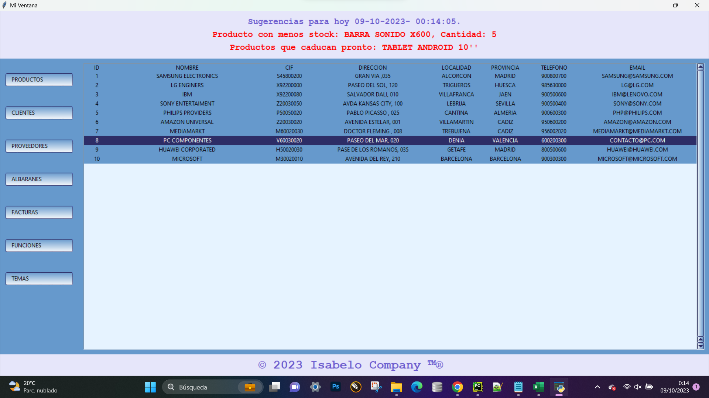
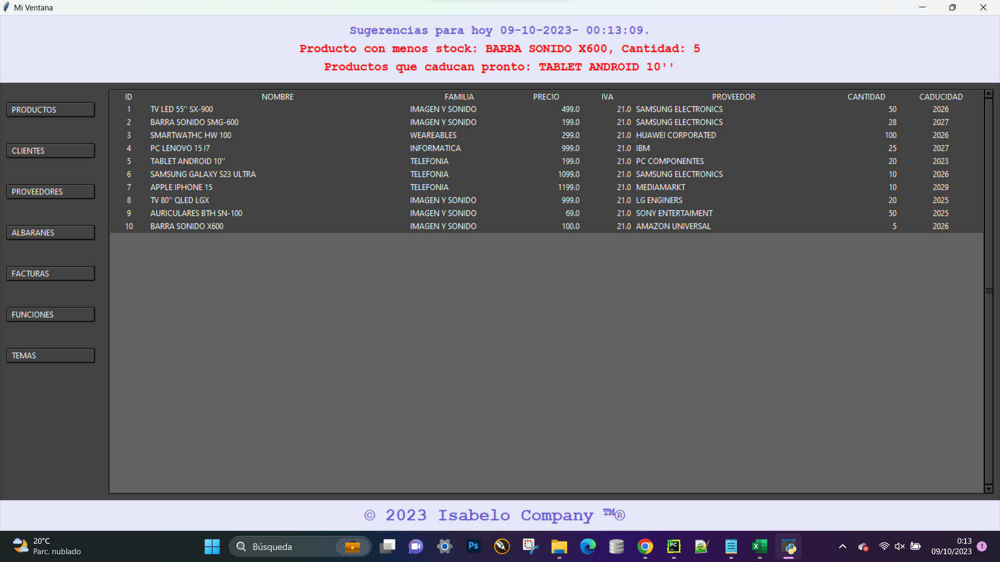
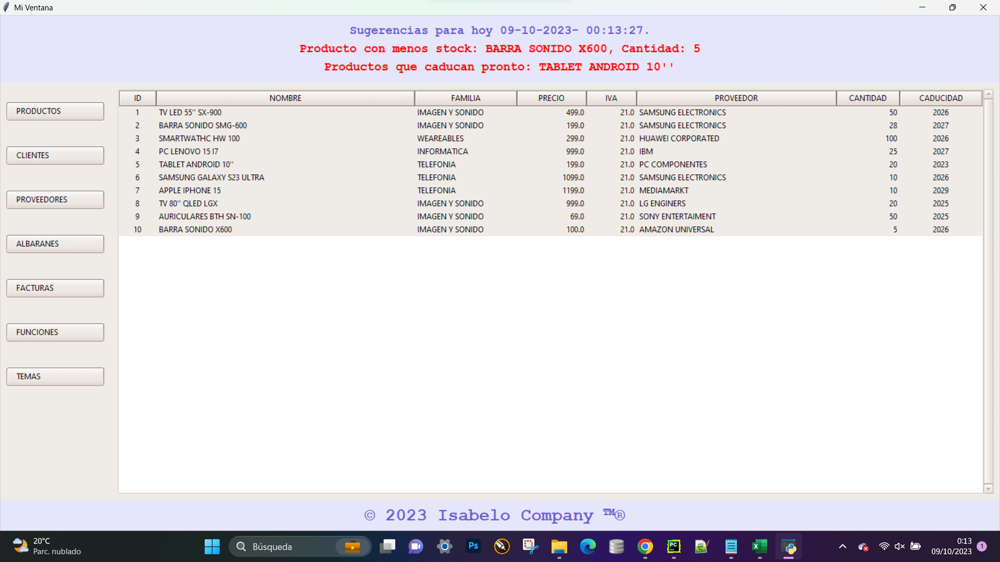
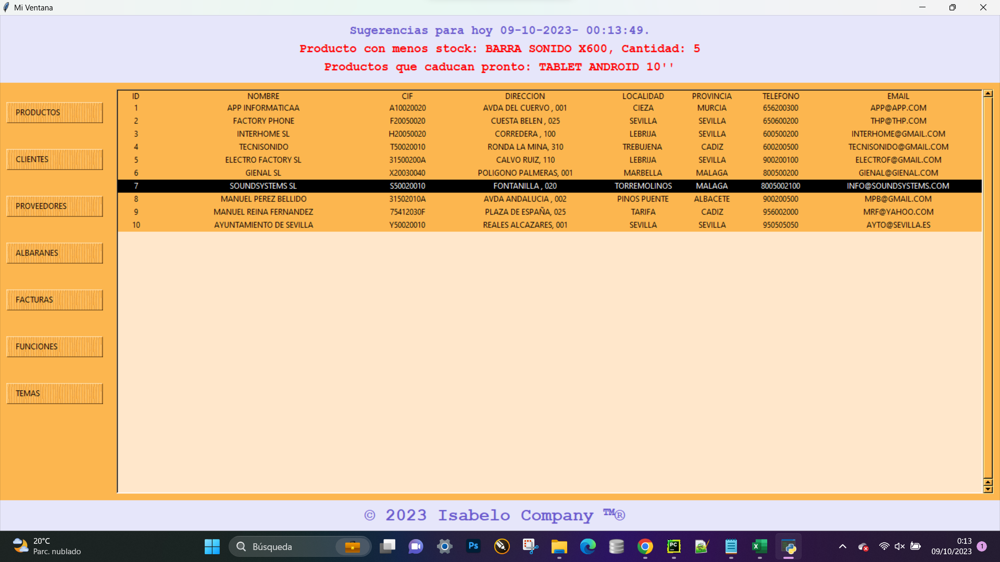
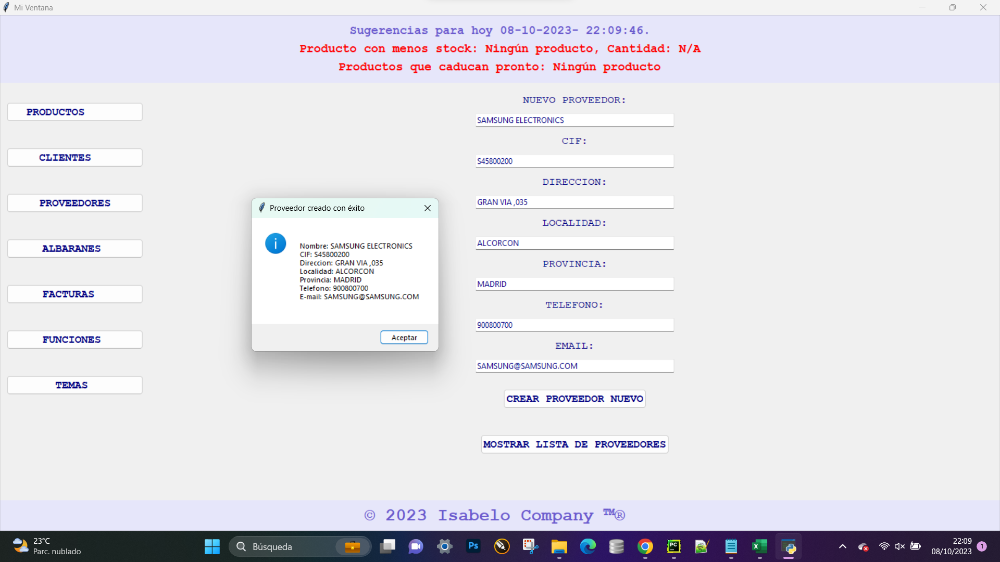
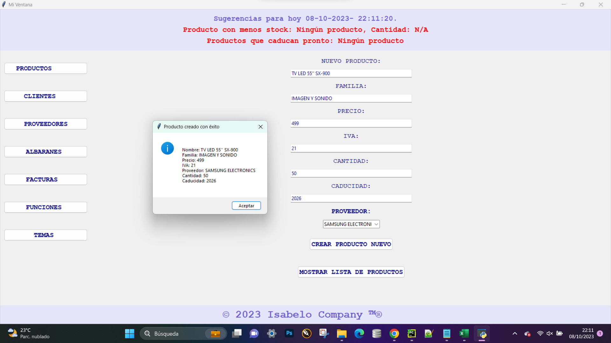

### Proyecto de Gestión de Datos y Usuarios
## Descripción
Este proyecto, desarrollado por **Isabelo Castillo** para **Tokio School**, es una aplicación completa para la gestión de usuarios y datos, enfocada en proporcionar una interfaz interactiva y funcional para la manipulación de información de productos y usuarios. Utilizando un stack tecnológico moderno y eficiente, esta aplicación ofrece un conjunto de herramientas robustas para el manejo de bases de datos y la generación de reportes.

## Características**
**Gestión de Usuarios:** A través de un sistema de autenticación y manejo de usuarios, el proyecto permite la administración segura de accesos y perfiles.
**Interfaz Gráfica:** Construida con **Tkinter**, proporciona una experiencia de usuario intuitiva y fácil de usar para la navegación y gestión de datos.
**Manipulación de Datos:** Con funcionalidades para añadir, actualizar y visualizar datos de productos almacenados en una **base de datos SQLite.**
**Generación de Reportes**: Capacidad para crear y visualizar **reportes en formato PDF**, facilitando el **análisis** y la presentación de los **datos**.
## Stack Tecnológico
**Python:** Como lenguaje de programación principal.
**Tkinter:** Para la creación de la interfaz gráfica de usuario.
**SQLite:** Como sistema de gestión de bases de datos.
**Librerías Adicionales:** future, ttkthemes, reportlab para funcionalidades específicas como temas de interfaz y generación de documentos PDF.
**Herramientas de Desarrollo:** PyCharm o Visual Studio Code, DB Browser para SQLite y Adobe Reader o Acrobat para la visualización de PDFs.
**Estructura del Proyecto**
**login.py:** Gestión de la autenticación de usuarios.
**main.py:** Script principal de la aplicación.
**database.py:** Funciones para la conexión y manejo de la base de datos de productos.
**funciones.py:** Funciones auxiliares para la actualización y manejo de datos.
**clases.py:** Definición de la clase Producto para la gestión de datos de productos.
**usuarios.db** y **database.db:** Bases de datos SQLite utilizadas por la aplicación.
## Instalación y Configuración
Para instalar y ejecutar este proyecto, sigue las instrucciones detalladas en el archivo **requirements.txt** para la instalación de dependencias y asegúrate de tener las herramientas adecuadas como se menciona en el stack tecnológico.

## Proyecto fin de curso de Isabelo para Tokio School

## Imagenes de la interfaz

